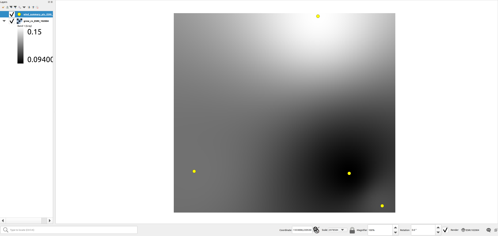
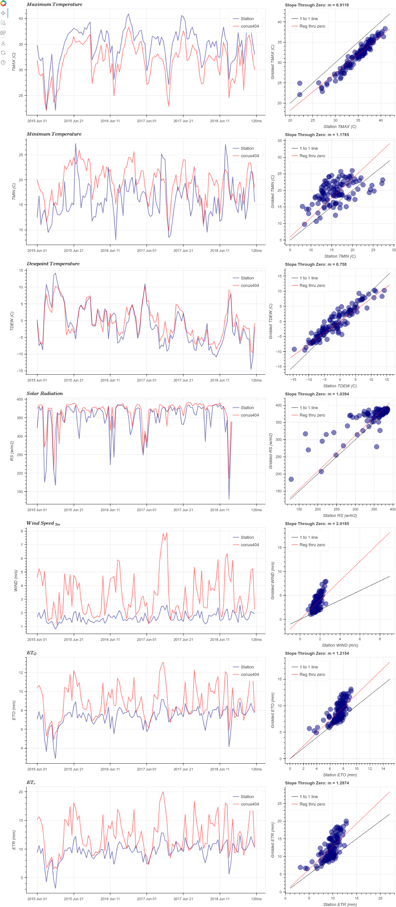
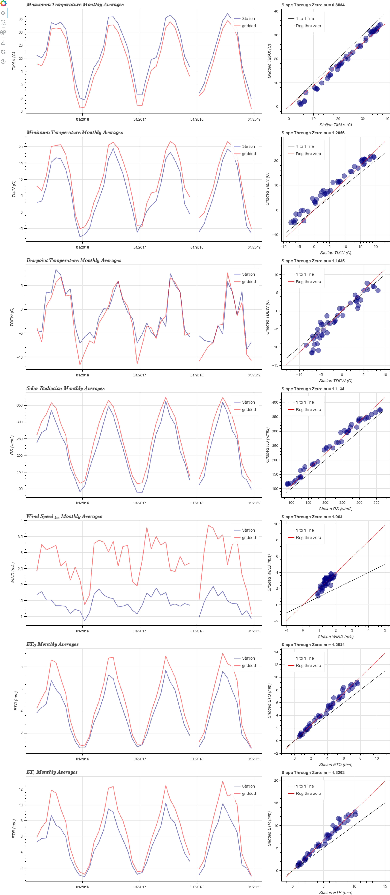

Tutorial
========

This tutorial describes in detail how to use the ``gridwxcomp`` Python
package including preparation of input data, downloading gridded data
and pairing it with station weather data, calculating monthly bias
ratios between station and gridded data, spatial interpolation of point
results, and generating interactive graphics files.

.. code:: python
    
    # module and function imports
    import pandas as pd
    import numpy as np
        
    from gridwxcomp import prep_metadata
    from gridwxcomp import calc_bias_ratios
    from gridwxcomp import download_grid_data
    from gridwxcomp import prep_metadata
    from gridwxcomp import spatial
    from gridwxcomp import plot

Input data files and formatting requirements
--------------------------------------------

There are three input files used by ``gridwxcomp``, they include:

1. configuration text file [.INI]
2. text or Microsoft Excel files containing time series of station
   weather data [.CSV, .XLS, XLSX]
3. text file containing metadata regarding the weather stations [.CSV]

An example of each of these files is included in with this package, they
can be found in the “example_data” folder in the package after
installation, if you installed using PiP you can find the path to the
example data station metadata file where the other example data also
exists (in the same directory) by running:

.. code:: python

   import pkg_resources; print(pkg_resources.resource_filename('gridwxcomp', 'example_data/Station_Data.txt'))

Or you can directly download the example files from GitHub
`here <https://github.com/WSWUP/gridwxcomp/tree/master/gridwxcomp/example_data>`__.

.. Tip:: 
    To follow this tutorial it is recommended to start a Python script or
    Jupyter Notebook from within the provided "example_data" folder.

The configuration file
~~~~~~~~~~~~~~~~~~~~~~

The configuration file is a text file with the “.INI” extension and is
read using the Python :obj:`configparser.ConfigParser` class to read
in metadata about the control parameters that the user specifies for
``gridwxcomp``. This file contains key control parameters for a 
``gridwxcomp`` workflow such as which gridded data to download, 
coordinate references system and domain for interpolation, and variable 
names and units.

The configuration file has three sections, **METADATA**, **DATA**, and
**UNITS**, and these sections are defined by there names inside of
brackets, e.g., the units section comes after the line that contains the
text “[UNITS]”.

The **METADATA** section includes information on the spatial domain,
resolution, and projection for spatial interpolation of results, as well
as the name of the gridded dataset to download from Google Earth
including the dataset’s collection path and start and end date of data
to download. Most of these options are self explanatory, here is an
example **METADATA** snippet from the provided example configuration
file that was built to download gridded data from the CONUS404 dataset:

::

   [METADATA]
   # Projection information
   #   gridwxcomp will reproject point data to WGS84 geographic for consistency with
   #   point data that is downloaded from Google Earth Engine, if the input coordinates
   #   are not already in WGS84 decimal degrees then specify they are in here using EPSG
   #   or ESRI code. The "grid_resolution" parameter refers to an optional fishnet grid 
   #   that can be created by gridwxcomp which is always created in the WGS 84 geographic 
   #   coordinate reference system, hence the resolution is in decimal degrees. gridwxcomp 
   #   can also reproject point data for the generation of a point shapefile containing 
   #   bias results and before performing spatial resolution.
   #   Finally the interpolated rasters are reprojected back to WGS 84 and resampled once 
   #   more using the output_data_resolution parameter (degrees). The example values
   #   shown below refer to WGS 84 (EPSG:4326) geographic coordinate system and the 
   #   Lambert Conformal Conic (ESRI:102004) projected coordinate system, and these are the
   #   default options if the user forgets to specify the parameters in the config file.
   input_data_projection = EPSG:4326 
   grid_resolution = 0.1 
   interpolation_projection = ESRI:102004 
   interpolation_resolution = 1000 
   output_data_resolution = 0.1

   # Bounding information
   # 	The bounds/extents for the interpolation area in decimal degrees.
   xmin = -111.8708332996666428
   xmax = -108.6208332996662733
   ymin = 38.0874999999668162
   ymax = 40.5874999999666741

   # Gridded dataset information
   #   Specify the Earth Engine image collection you'd like to use for comparison.
   #   collection_name will be used in the generation of filenames
   #   You may also specify the start and end dates (Format: YYYY-MM-DD) of the data to download.
   #   If the dates are left blank then gridwxcomp will generate these values automatically.
   collection_name = conus404
   collection_path = projects/openet/assets/meteorology/conus404/daily
   start_date = 
   end_date = 

   # File structure information
   #   These values are necessary for gridwxcomp to parse the data files.
   #   Use 'station' for observed and 'gridded' for any model data
   #   Anemometer height required in meters
   station_anemometer_height = 2
   station_lines_of_header = 1
   station_missing_data_value = nan

   gridded_anemometer_height = 10
   gridded_lines_of_header = 1
   gridded_missing_data_value = nan

.. Note::
    The station and gridded data wind speed height (anemometer height) are
    needed so that the wind speed data can both be scaled to 2 m using the
    logarithmic vertical velocity profile, see equation 33 in [Allen2005]_.

The second section of the configuration file is called **DATA**; this
section is exclusivly for the user to specify the names of the station
and gridded weather data as they are found in the station weather data
CSV files (in the headers) and as they are named for the specified
Google Earth Engine data collection. Here is an example for the CONUS404
dataset and the provided weather data:

::

   [DATA]
   # For the below parameters, enter the name of the column containing the following values
   #   If a column is not provided, leave the parameter blank.

   station_date_col = date
   station_tmax_col = TMax (C)
   station_tmin_col = TMin (C)
   station_rs_col = Rs (w/m2)
   station_wind_col = ws_2m (m/s)
   station_ea_col =
   station_tdew_col = TDew (C)
   station_rhmax_col = RHMax (%)
   station_rhmin_col = RHMin (%)
   station_rhavg_col = RHAvg (%)
   station_eto_col = ETo (mm)
   station_etr_col = ETr (mm)

   gridded_date_col = date
   gridded_tmax_col = T2_MAX
   gridded_tmin_col = T2_MIN
   gridded_rs_col = ACSWDNB
   gridded_wind_col = WIND10
   gridded_ea_col = 
   gridded_tdew_col = TD2
   gridded_rhmax_col =
   gridded_rhmin_col =
   gridded_rhavg_col =
   gridded_eto_col = ETO_ASCE
   gridded_etr_col = ETR_ASCE

The final and third section of the ``gridwxcomp`` configuration input
file is the **UNITS** section, which as the name implies, allows the
user to specify the units of the station and gridded weather data that
the software will parse. This is critical so that the software can
convert units is necessary so that they match before computing
station:gridded monthy bias ratios. The unit conversion is done by the
:func:`gridwxcomp.calc_bias_ratios` function. Here is an example of
this section from the provided example data:

::

   [UNITS]
   # For the parameters in this section, enter the corresponding units from the options commented above.

   # K, F, C
   station_temp_units = C
   gridded_temp_units = K

   # kw-hr/m2, j/m2, mj/m2, langleys, w/m2
   station_solar_units = w/m2
   gridded_solar_units = j/m2

   # m/s, mph, kmph
   station_wind_units = m/s
   gridded_wind_units = m/s

   # kPa, torr, mbar
   station_ea_units = kpa
   gridded_ea_units =

   # percent, fraction
   station_rh_units = percent
   gridded_rh_units =

   # inches, mm
   station_et_units = mm
   gridded_et_units = mm

.. _variable_list:

Weather variables processed by ``gridwxcomp``
~~~~~~~~~~~~~~~~~~~~~~~~~~~~~~~~~~~~~~~~~~~~~

The available input options for weather variables and their units
currently allowed by ``gridwxcomp`` are as follows:

   =================== ================================================================== ======================================
   Variable             Description                                                        Allowable Unit(s)         
   =================== ================================================================== ======================================
   tmax, tmin, tdew     maximum, minimum and dew point air temperature                     c, f, k
   rs                   solar radiation                                                    kw-hr/m2, j/m2, mj/m2, langleys, w/m2
   wind                 wind speed                                                         m/s, mph, kmph                                
   ea                   vapor pressure                                                     kPa, torr, mbar
   rhmax, rhmin, rhavg  maximum, minimum and average relative humidity                     percent, fraction                              
   eto, etr             short (grass) and tall (alfalfa) ASCE standardized reference ET    inches, mm
   =================== ================================================================== ======================================

The converted weather variables will not be written to files, they are
converted so that the pairing of station:gridded data can be done before
computing and saving average bias ratios or temperature differences.

The weather station’s data files
~~~~~~~~~~~~~~~~~~~~~~~~~~~~~~~~

Files containing daily time series of weather station data are the key
input to ``gridwxcomp``. These files should be formatted as comma
separated variable [.CSV] text files or Microsoft Excel files [.XLS or .
XLSX]. The names of variables that can be used by ``gridwxcomp`` should
be listed in the configuration file and they should match the data as
they are found in the weather station and gridded data file headers.
Here is an example of the first three rows and first seven columns of an
example weather station data:

+---------------------+----------+----------+----------+----------+------------------+-----------+
| date                | TAvg (C) | TMax (C) | TMin (C) | TDew (C) | Vapor Pres (kPa) | RHAvg (%) |
+=====================+==========+==========+==========+==========+==================+===========+
| 2013-11-07 00:00:00 | 4.382    | 15.83    | -4.331   | -4.7     | 0.431            | 55.25     |
+---------------------+----------+----------+----------+----------+------------------+-----------+
| 2013-11-08 00:00:00 | 4.005    | 19.3     | -7.252   | -5.65    | 0.401            | 55.65     |
+---------------------+----------+----------+----------+----------+------------------+-----------+
| 2013-11-09 00:00:00 | 3.019    | 19.1     | -6.842   | -4.98    | 0.422            | 54.95     |
+---------------------+----------+----------+----------+----------+------------------+-----------+

.. tip:: 
    The “date” column in the provided weather data will be parsed by
    :mod:`pandas` and should be in a format that is able to automatically
    converted to a :obj:`datetime.datetime` object using the :func:`pandas.to_datetime` 
    function. For example, “YYYY/MM/DD” or “YYYY-MM-DD HH:MM:SS”.

The weather station’s metadata file
~~~~~~~~~~~~~~~~~~~~~~~~~~~~~~~~~~~

Within the same folder of the station weather data files the user must
provide a text file [.CSV] that lists all the weather stations that are
to be included in the ``gridwxcomp`` routines and for each station, this
file lists some key metadata. There are four columns that are required
by ``gridwxcomp`` to be provided in this file: ‘Latitude’, ‘Longitude’,
‘Filename’, and ‘Station’. Filename refers to the name of the weather
station data file, e.g., “BedrockCO_Daily_output.xlsx”. The “Station”
column should contain the ID that the user wants to use for that station
and this will be used for output file names that apply to that station
and in different outputs, e.g., the ID given to to the stations in the
bias ratio files and point shapefiles. Here is an example of a station
metadata file with the four required columns:

+-------------------------+------------------+-------------------+----------------------------------+---------+
| Station                 | Latitude         | Longitude         | Filename                         | Elev_FT |
+=========================+==================+===================+==================================+=========+
| Bluebell (Neola Area)   | 40.3723213601075 | -110.209184085302 | BluebellUT_Daily_output.xlsx     | 6186    |
+-------------------------+------------------+-------------------+----------------------------------+---------+
| Loa                     | 38.3834675639262 | -111.635832870077 | LoaUT_Daily_output.xlsx          | 7116    |
+-------------------------+------------------+-------------------+----------------------------------+---------+
| Bedrock                 | 38.328297440752  | -108.855494308994 | BedrockCO_Daily_output.xlsx      | 4973    |
+-------------------------+------------------+-------------------+----------------------------------+---------+
| Castle Valley near Moab | 38.6429447999517 | -109.398808843297 | CastleValleyUT_Daily_output.xlsx | 4687    |
+-------------------------+------------------+-------------------+----------------------------------+---------+

.. Tip::
    Any additional columns that exist in the weather station metadata file will
    be retained and added to the formatted output CSV file that is produced by
    the :func:`gridwxcomp.prep_metadata` function. However they will not be
    used by any of the following procedures, only the four required columns’
    values are used (‘Latitude’, ‘Longitude’, ‘Filename’, and ‘Station’). In
    the exampe above, the extra columns that were provided are “Elev_FT” and
    “Location”.

Step 1: Parse input data
------------------------

The first step to running ``gridwxcomp`` after preparing the required
input data as specified in
:ref:`Input data files and formatting requirements` is to run the
:func:`gridwxcomp.prep_metadata` function which reads the station
metadata file and prepares for downloading gridded data. This step is 
straightforward with minimal options involved:

.. code:: python3

    # specify the paths to input data files, in this case using the provided example data:
    station_meta_path = '/path/to/gridwxcomp/gridwxcomp/example_data/Station_Data.txt'
    conus404_config = '/path/to/gridwxcomp/gridwxcomp/example_data/gridwxcomp_config_conus404.ini'
    gridded_dataset_name = 'conus404'
    
    # run the function 
    prep_metadata(station_meta_path, conus404_config, gridded_dataset_name)

The file that was produced from running
:func:`gridwxcomp.prep_metadata` is named “formatted_input.csv” by
default and it will be saved to the workspace where the function is
called from unless otherwise stated in the . It has updated the paths to the station weather data and
reformatted the station metadata file. This will be the input file used
for the next two steps in the ``gridwxcomp`` workflow which are
:func:`gridwxcomp.ee_download` and
:func:`gridwxcomp.calc_bias_ratios`.

Step 2: Download gridded timeseries data from Google Earth Engine
-----------------------------------------------------------------

After running :func:`gridwxcomp.prep_metadata` the next step is to use
the formatted CSV file that was created alongwith the configuration
input file as input to download the specified gridded data that
corresponds with the locations and variables of the weather stations.
Some of that required information is in the configuration file, such as
the dataset collection path on Google Earth Engine and its name. Some
data required to download Earth Engine gridded climate data needs to be
specified as arguments to the :func:`gridwxcomp.ee_download.download_grid_data`
function, such as the bucket to export the extracted point time series
data to and the local folder to download the same data to.

.. important::
    Before downloading data using the Earth Engine Python API, the use must
    initialize Earth Engine locally and have permissions to access the
    requested data as well as to export data on the Google Cloud. After setting
    up Google Earth Engine locally following the `online instructions
    <https://developers.google.com/earth-engine/guides/python_install>`__, one
    can initialize Earth Engine in Python using the following line:

.. note::
   The example data used in this tutorial downloads gridded data from the 
   `CONUS404 dataset <https://support.climateengine.org/article/117-conus404>`__ which 
   is hosted by OpenET on Google Earth Engine, it is a public asset and as long as you 
   have access to Google Earth Engine you should have no issues accessing the data. 
   The export path that is specified in the tests will be automatically created and 
   you must have authenticated and initialized Google Earth Engine for Python before 
   running the tests. 

.. code:: python3

   import ee
   ee.Authenticate()
   ee.Initialize(project='my-project')

Now we can download gridded data:

.. code:: python3

    # Specify the path to the file created by running prep_metadata
    formatted_input_file = '/path/to/gridwxcomp/gridwxcomp/example_data/formatted_input.csv'
    
    import ee
    ee.Initialize()
    # download the gridded data
    download_grid_data(
        formatted_input_file, 
        conus404_config, 
        export_bucket='your_bucket_root_to_export', # Google bucket root to export to on 
        export_path='path_within_bucket_to_export', # path to export data to
        local_folder=None, # If not specified then the gridded data will be downloaded to a new folder
        force_download=False, # if False check if data already exists locally, if True overwrite
    )

The export bucket and paths will be created if they do not already exist in 
your Google Cloud storage. 

.. Note::
    If the start and end dates for downloading gridded weather data are not
    specified in the configuration file, the entire period of record of gridded
    data will be downloaded for each station (at the overlapping grid cell).
    And this process may be time consuming.

After running :func:`gridwxcomp.ee_download.download_grid_data` time series of the
weather data will be saved to a folder that is named using the gridded
data collection name as specified in the configuration file. This folder
will be created where the download function is called, in this case in
the “example_data” folder. The individual files containing the gridded
time series at the station locations will be named using the gridded
dataset name, the station name, and the start and end dates that were
used for downloading, for example:
``"[collection_name]_[station]_[start_date]_[end_date]_all_vars.csv"``

Here is the file structure that should have been produced after up to
this stage assuming that the “example_data” folder was used as the
working space for running this tutorial:

::

   example_data/
   ├── BedrockCO_Daily_output.xlsx
   ├── BluebellUT_Daily_output.xlsx
   ├── CastleValleyUT_Daily_output.xlsx
   ├── conus404
   │   ├── conus404_bedrock_19791001_20220928_all_vars.csv
   │   ├── conus404_bluebell_neola_area_19791001_20220928_all_vars.csv
   │   ├── conus404_castle_valley_near_moab_19791001_20220928_all_vars.csv
   │   └── conus404_loa_19791001_20220928_all_vars.csv
   ├── formatted_input.csv
   ├── gridwxcomp_config_conus404.ini
   ├── LoaUT_Daily_output.xlsx
   └── Station_Data.txt

At this step in the normal workflow of ``gridwxcomp`` the output file created by :func:`gridwxcomp.ee_download.download_grid_data` can be used for making interactive daily and monthly time series and scatter plots of paired station and gridded weather data using the :mod:`gridwxcomp.plot` module.
Skip to :ref:`Interactive graphics of paired station:gridded weather data` for examples.

Step 3: Calculate monthly, seasonal, and annual station:gridded biases and statistics
-------------------------------------------------------------------------------------

After parsing the input station weather data and configuration options,
and downloading the corresponding gridded weather data of choice, the
next step in the ``gridwxcomp`` workflow is computing station:gridded
biases. This process involved pairing the station and gridded time
series together for overlapping time periods, making necessary unit
conversions, and computing monthly, seasonal, and annual average bias
ratios (or differences for air temperature) between the station and
gridded data for each variable that is available or specified.
Additional metrics are calculated that are helpful to evaluate the
variability in the station:gridded ratios such as the annual standard
deviation and coefficients of variation for the bias ratios or
differences, as well as the number of paired data points used to compute
the bias ratios or differences. In addition to calculating long-term
average monthly bias ratios or differences between station:gridded data,
summer periods (JJA), growing season (AMJJASO), and annual periods are
also used for computing the metrics.

To run the bias corrections, the :func:`gridwxcomp.calc_bias_ratios`
reads the formatted metadata file created by
:func:`gridwxcomp.prep_metadata` and the configuration file. The user
should also specify the folder to save the output file, which variable
to use for the calculations from the list of available variables: see
:ref:`variable_list`, the maximum number of gaps days per month
allowed for computations (``day_limit`` kwarg to
:func:`gridwxcomp.calc_bias_ratios`, default is ten days maximum of
gap days), and the year range to use for the calculations in case one is
not interested in using the full data record.

There are two methods for calculating the bias ratios or differences,
the “long_term_mean” and the “mean_of_annual”. The default method
(``method='long_term_mean'``) first groups the paired station and
gridded data for each time period (monthly, etc.) and then takes the
average of station and gridded data respectively before taking the ratio
or difference, for example,

.. math::  \frac{ \frac{\sum_{i=1}^{n} station_i}{n}} {\frac{\sum_{i=1}^{n} grid_i}{n}} 

where :math:`station_i` and :math:`grid_i` are the :math:`i^{th}` paired
daily weather data in the full record for a given temporal period, such
as all the summer days or all the days that fall within the month of
May. For air temperature variables, as opposed to taking the ratio the
calculation is

.. math::   \frac{\sum_{i=1}^{n} station_i}{n} - \frac{\sum_{i=1}^{n} grid_i}{n}. 

The other option for calculating the bias ratios or temperature
differences between station and gridded data
(``method='mean_of_annual'``) is similar except it makes the calculation
as shown above for each year in the paired data record separately, and
then it takes the average of those annual ratios or differences. This
approach is always used for calculating the statndard deviation and
coefficient of variation variables that are also computed by the
:func:`gridwxcomp.calc_bias_ratios` function.

This example code uses the default methods for calculating the station:gridded
point bias statistics:

.. code:: python3

    # directory to save results of point calculations
    output_dir = 'test_data_bias_results'
    
    calc_bias_ratios(
        input_path=formatted_input_file,
        config_path=conus404_config,
        out_dir=output_dir,
        method='long_term_mean',
        comparison_var='wind'
    )

Here is a selection of the results for the month of January from the
output CSV file that was created which was named
“wind_summary_comp_all_yrs.csv”:

+-----------------------+-------------------+-----+-----------+-----+-----------+-----+--------+
| STATION_ID            | Jan_mean          | ... | Jan_count | ... | Jan_stdev | ... | Jan_cv |
+=======================+===================+=====+===========+=====+===========+=====+========+
| Bluebell (Neola Area) | 0.648012105097692 | ... | 62        | ... | 0.108     | ... | 0.163  |
+-----------------------+-------------------+-----+-----------+-----+-----------+-----+--------+
| Loa                   | 1.15758848442987  | ... | 62        | ... | 0.001     | ... | 0      |
+-----------------------+-------------------+-----+-----------+-----+-----------+-----+--------+

The file retains the structure of the station metadata that was
previously reformmated by the :func:`gridwxcomp.prep_metadata` and :func:`gridwxcomp.ee_download.download_grid_data`, 
in that it each rows refers to a distinct weather station and any metadata 
that was in the original station metadata file created by the user 
is retained. There are four major variables calculated by :func:`gridwxcomp.calc_bias_ratios` 
that were added to this file, they are the long-term mean bias ratios (suffix
“\_mean”), the count of paired days used in those calculations (suffix
“\_count”), the standard deviation of the annual bias ratios or
differences (suffix “stdev”), and the coefficient of variation (suffix
“\_cv”).

At this step in the normal workflow of ``gridwxcomp`` the output file created by :func:`gridwxcomp.calc_bias_ratios` can be used for spatial mapping of point data and interpolation of the results using the :mod:`gridwxcomp.spatial` module.

Spatial mapping and interpolation of station:gridded bias results
-----------------------------------------------------------------

One of the key functionalities of ``gridwxcomp`` is the ability to
spatially map and interpolate point data of station:gridded bias. The
point bias and variability statistics that have been produced using the
:func:`gridwxcomp.calc_bias_ratios` is the main input to the spatial
functions along with geographic reference system information that is
defined in the configuration file.

Mapping point data
~~~~~~~~~~~~~~~~~~

It is useful to make a 2-D map of station point data results from the
bias correction calculations. The
:func:`gridwxcomp.spatial.make_points_file` offers a quick routine for
making a georeferenced point vector file (shapefile) of the station
results using the data output from
:func:`gridwxcomp.calc_bias_ratios`:

.. code:: python3

    # path to output from calc_bias_ratios
    bias_ratios_file = '/path/to/gridwxcomp/my_specific_tests/test_data_bias_results/wind_summary_comp_all_yrs.csv'
    
    # make point shapefile
    spatial.make_points_file(bias_ratios_file)

Here is a screenshot of the resulting shapefile in QGIS: 

.. image:: _static/points_wgs84.png
   :align: center

.. raw:: html

        

Two shapefiles files were output from this function, one in the WGS84 geographic coordinate system and another in the coordinate reference system that the user supplied in the configuration file as defined by the "interpolated_projection" parameter in the **METADATA** section, see :ref:`The configuration file`. The coordinate reference system will be added as a suffix to the two shapefiles, in this case the files are named "wind_summary_pts_wgs84.shp" and "wind_summary_pts_ESRI_102004.shp" respectively. As shown in the screenshot the average monthly, seasonal, and annual ratios, day counts, standard deviation, and coefficient of variation statistics are included in these shapefiles.

.. Caution::
    If the "interpolation_projection" parameter is not specified in the
    configuration file, ``gridwxcomp`` will default to use the Lambert
    Conformal Conic "ESRI:102004" projected space for spatial interpolation.
    The LCC projection is useful for minimizing distortion for larger
    interpolation areas, particularly those that span areas that cross larger
    distances from east-to-west, as opposed to north-south. 

Making a fishnet polygon (grid) around stations
~~~~~~~~~~~~~~~~~~~~~~~~~~~~~~~~~~~~~~~~~~~~~~~

The :func:`gridwxcomp.spatial.make_grid` function offers a quick way
to make a uniform (square) fishnet or grid polygon file that is defined
by the output and grid resolution parameters set in the configuration
file. The grids coordinate reference system will be WGS 84 and therefore
the grid_resolution and bounds parameters in the configuration file
should be in decimal degrees.

This is an optional step that is only used again by ``gridwxcomp`` if
the user sets the ``z_stats==True`` kwarg to the
:func:`gridwxcomp.spatial.interpolate` function, that option will
conduct zonal averages of the interpolated bias surfaces using the grid
produced by :func:`gridwxcomp.spatial.make_grid`.

.. code:: python3

    # Example making the spatial grid
    spatial.make_grid(bias_ratios_file, conus404_config)

Here is a screenshot of the resulting grid shapefile in QGIS: 

.. image:: _static/grid.png
   :align: center

.. raw:: html

        

Spatial interpolation of point bias
~~~~~~~~~~~~~~~~~~~~~~~~~~~~~~~~~~~

One of the key features of ``gridwxcomp`` is its ability to perform spatial mapping of bias results between station and gridded weather data using the scatter point data previously calculated at the station locations. The
:func:`gridwxcomp.spatial.interpolate` function has the ability
interpolate the point bias data calculated by the
:func:`gridwxcomp.calc_bias_ratios` function using the options that
are available from
`GDAL grid <https://www.gdal.org/gdal_grid.html>`__, those options
are the following:

-  ‘average’
-  ‘invdist’ (inverse distance weighting)
-  ‘invdistnn’ (inverse distance weighting with :math:`n` nearest
   neighbors)
-  ‘linear’
-  ‘nearest’

The interpolation of point data will be conducted using the projected coordinate
reference system and resolution (meters) that was specified for
interpolation in the configuration file, the default if not specified is
Lambert Conformal Conic (ESRI:102004) projection and 1000 m resolution.
For convenience, the :func:`gridwxcomp.spatial.interpolate` function
offers the ``scale_factor`` argument to quickly scale the interpolation
resolution that is specified in the configuration file.

The outputs of the :func:`gridwxcomp.spatial.interpolate` function
include:

-  georeferenced raster images of the interpolated surfaces for the
   specified variables
-  a point shapefile in the interpolated reference system updated with
   point residuals and interpolated values
-  a CSV file with the station:gridded bias results updated with point
   residuals and interpolated values
-  a bar plot with point residuals
-  an (optional) CSV file with zonal statistics based on the fishnet the
   grid produced by the :func:`gridwxcomp.spatial.make_grid` function.

Two versions of the interpolated rasters are created for each variable
specified (e.g., the monthly or seasonal station:gridded bias ratios for
a given weather variable). One raster is created and saved using the
coordinate reference system and resolution as specified for
interpolation in the configuration file, and the other raster will be
reprojected to WGS 84 geographic reference system and bi-linearly
resampled using the “output_data_resolution” parameter (degrees) as
specified in the configuration file. For example, using the defalt
projections and resolution, if the user ran the following code the
resulting output file structure would be created:

.. code:: python3

    # The default interpolation method with only one layer (annual) being interpolated
    spatial.interpolate(bias_ratios_file, conus404_config, layer="annual", z_stats=True)

::

   wind_invdist_1000_meters/
   ├── annual_ESRI_102004.tiff
   ├── annual.tiff
   ├── residual_plots
   │   └── annual_res.html
   ├── wind_summary_comp_all_yrs.csv
   ├── wind_summary_pts_ESRI_102004.cpg
   ├── wind_summary_pts_ESRI_102004.dbf
   ├── wind_summary_pts_ESRI_102004.prj
   ├── wind_summary_pts_ESRI_102004.shp
   ├── wind_summary_pts_ESRI_102004.shx
   └── zonal_stats.csv

Note that the name of the root directory contains the name of the
variable that was interpolated (“wind”), the interpolation method
(“invdist”), and the resolution of the interpolation (1000 m).

Here is a screenshot of the resulting interpolated raster with overlain
station points:

.. image:: \_static/interpolated_annual_mean.png 
   :align: center

.. raw:: html

       
      
Zonal statistics and resampling of interpolated bias surfaces
~~~~~~~~~~~~~~~~~~~~~~~~~~~~~~~~~~~~~~~~~~~~~~~~~~~~~~~~~~~~~

The :func:`gridwxcomp.spatial.interpolate` function will produce a 
second raster for each specified variable that is interpolated. This 
raster is always reprojected to the WGS 84 geographic reference system 
and then bilinearly resampled to the “output_data_resolution” defined 
in the configuration file. In this example it was resampled to 0.1 
degrees which was the same resolution as the grid shapefile
produced by :func:`gridwxcomp.spatial.make_grid`. The WGS 84 
geographic reference system is always used as the reference system 
for the grid shapefile generation. Being in the same geographic 
coordinate reference system allows for using the grid to be used 
for computing zonal statistics. The WGS 84 resampled raster files can be 
distinguished from the interpolated files as they do not have 
a suffix signifying a coordinate reference system code such as 
“..._ESRI_XXXXX.tif” or “..._EPSG_XXXX.tif”. 

Here is a screenshot of the fishnet grid produced eariler in the tutorial
(see :ref:`Making a fishnet polygon (grid) around stations`) and the 
resampled raster in WGS 84:

.. image:: \_static/resampled_annual_mean_with_grid.png
   :align: center

.. raw:: html

       

.. hint:: The interpolation in this example was performed in the Lambert
	Conformal Conic projected coordinate reference system, then it was
	reprojected into the WGS 84 space. When the raster is
	reprojected it distorts the image with respect to the
	original bounding coordinates that are used to clip the reprojected
	raster and to build the fishnet grid. This would vary depending on how much
	distortion exists between WGS 84 and the specified interpolation
	projection. To get a larger area covered in the resampled raster it
	is advised to use a larger bounding area, with a buffer around the
	outer station locations.
	
In this example the grid resolution and the resampling resolution of the
interpolated surfaces are the same, if that is the case we can see that
the grid and rasters snap to one another. However it may be useful to
create the grid at a different resolution depending on the application
of the zonal statistics (zonal means). Note that in this example the
zonal statistics were saved to a CSV file, the outputs of which are
simply a zonal average for each grid cell ID:

.. code:: python3

    # here are the first cells zonal results from the grid
    pd.read_csv('test_data_bias_results/spatial/wind_invdist_1000_meters/zonal_stats.csv')[:10]

.. raw:: html

    

    
    <table border="1" class="dataframe">
      <thead>
        <tr style="text-align: right;">
          <th></th>
          <th>GRID_ID</th>
          <th>annual</th>
        </tr>
      </thead>
      <tbody>
        <tr>
          <th>0</th>
          <td>1000000</td>
          <td>NaN</td>
        </tr>
        <tr>
          <th>1</th>
          <td>1000001</td>
          <td>NaN</td>
        </tr>
        <tr>
          <th>2</th>
          <td>1000002</td>
          <td>NaN</td>
        </tr>
        <tr>
          <th>3</th>
          <td>1000003</td>
          <td>NaN</td>
        </tr>
        <tr>
          <th>4</th>
          <td>1000004</td>
          <td>0.773542</td>
        </tr>
        <tr>
          <th>5</th>
          <td>1000005</td>
          <td>0.780634</td>
        </tr>
        <tr>
          <th>6</th>
          <td>1000006</td>
          <td>0.789373</td>
        </tr>
        <tr>
          <th>7</th>
          <td>1000007</td>
          <td>0.799754</td>
        </tr>
        <tr>
          <th>8</th>
          <td>1000008</td>
          <td>0.811946</td>
        </tr>
        <tr>
          <th>9</th>
          <td>1000009</td>
          <td>0.826092</td>
        </tr>
      </tbody>
    </table>
    

     

.. note:: 
	The grid cell IDs created by the :func:`gridwxcomp.spatial.make_grid` 
	function assign the first cell in the upper left giving it a value of 
	1000000 and this increments by one moving down the first column 
	(left most) then moves to the next column and continues down, from left to right.

Estimates and residuals between point data and interpolated surfaces
~~~~~~~~~~~~~~~~~~~~~~~~~~~~~~~~~~~~~~~~~~~~~~~~~~~~~~~~~~~~~~~~~~~~

One additional computation that occurs each time the
:func:`gridwxcomp.spatial.interpolate` function is used, is the
calculation of point estimates and residuals for the monthly, seasonal,
and annual bias ratios with respect to the interpolated rasters. In
other words, the bias ratios (or temperature differences) that were
calculated by the :func:`gridwxcomp.calc_bias_ratios` function at the
point locations are compared to the interpolated surfaces, and at the
point locations, the interpolated values are extracted from the raster
surfaces and the residuals are calculated:

.. math:: residual = interpolated - station~ calculation. 

The point estimates and residuals are then added 
to the summary CSV file that is within the interpolation folder 
and in the copy of the reprojected point shapefile. In this 
case these are the files:

::

   'test_data_bias_results/spatial/wind_invdist_1000_meters/wind_summary_comp_all_yrs.csv'

and the shapefile:

::

   'test_data_bias_results/spatial/wind_invdist_1000_meters/wind_summary_pts_ESRI_102004.shp'

Here is an example of the newly calculated estimates and residuals which
are distinguised by the “\_res” and “\_est” suffixes:

.. code:: python3

    df = pd.read_csv('test_data_bias_results/spatial/wind_invdist_1000_meters/wind_summary_comp_all_yrs.csv', index_col='STATION_ID')
    df[['annual_mean', 'annual_est', 'annual_res']]

.. raw:: html

    

    
    <table border="1" class="dataframe">
      <thead>
        <tr style="text-align: right;">
          <th></th>
          <th>annual_mean</th>
          <th>annual_est</th>
          <th>annual_res</th>
        </tr>
        <tr>
          <th>STATION_ID</th>
          <th></th>
          <th></th>
          <th></th>
        </tr>
      </thead>
      <tbody>
        <tr>
          <th>Bluebell (Neola Area)</th>
          <td>0.728636</td>
          <td>0.728635</td>
          <td>-3.342862e-07</td>
        </tr>
        <tr>
          <th>Loa</th>
          <td>1.058695</td>
          <td>1.058690</td>
          <td>-5.699448e-06</td>
        </tr>
        <tr>
          <th>Bedrock</th>
          <td>0.616712</td>
          <td>0.616711</td>
          <td>-7.578612e-07</td>
        </tr>
        <tr>
          <th>Castle Valley near Moab</th>
          <td>0.509929</td>
          <td>0.509935</td>
          <td>5.979035e-06</td>
        </tr>
      </tbody>
    </table>
    

     

In this case, the interpolated surface is nearly identical to the point
bias results (residuals near zero) because no smoothing parameters were
introduced in the inverse distance weighting algorithm. If we rerun the
spatial interpolation and introduce smoothing:

.. code:: python3

    # parameters for gdal grid's inverse distance weighting which will result 
    # in not honoring the station's values used to interpolate as an example to 
    # illustrate the calculated point estimates and residuals from the interpolated surface:
    params = {'power':0.5, 'smooth':50}
    spatial.interpolate(bias_ratios_file, conus404_config, layer="annual", params=params)
    
    # now view the same results:
    df = pd.read_csv('test_data_bias_results/spatial/wind_invdist_1000_meters/wind_summary_comp_all_yrs.csv', index_col='STATION_ID')
    df[['annual_mean', 'annual_est', 'annual_res']]

.. raw:: html

    

    
    <table border="1" class="dataframe">
      <thead>
        <tr style="text-align: right;">
          <th></th>
          <th>annual_mean</th>
          <th>annual_est</th>
          <th>annual_res</th>
        </tr>
        <tr>
          <th>STATION_ID</th>
          <th></th>
          <th></th>
          <th></th>
        </tr>
      </thead>
      <tbody>
        <tr>
          <th>Bluebell (Neola Area)</th>
          <td>0.728636</td>
          <td>0.727750</td>
          <td>-0.000885</td>
        </tr>
        <tr>
          <th>Loa</th>
          <td>1.058695</td>
          <td>1.006191</td>
          <td>-0.052504</td>
        </tr>
        <tr>
          <th>Bedrock</th>
          <td>0.616712</td>
          <td>0.625107</td>
          <td>0.008395</td>
        </tr>
        <tr>
          <th>Castle Valley near Moab</th>
          <td>0.509929</td>
          <td>0.544533</td>
          <td>0.034604</td>
        </tr>
      </tbody>
    </table>
    

     

With these smoothing parameters and a smaller power parameter for inverse
distance weighting we get significant larger interpolated error or point residuals.

.. seealso:: 
   There are other interpolation parameters available for the
   different interpolation methods provided by GDAL, see
   `this online reference <https://gdal.org/programs/gdal_grid.html#interpolation-algorithms>`__ 
   for a comprehensive list and description of each. 
   
.. hint::
   The default parameters used by :func:`gridwxcomp.spatial.interpolate` 
   interpolation algorithms are the same as those specified by GDAL.

Finally, there is a plot (or set of plots) that is produced to visualize
the residuals between the interpolated and point bias results, these are
saved as interactive HTML files with bar charts. In this example, here is 
the relative path to this file:

::

   'test_data_bias_results/spatial/wind_invdist_1000_meters/residual_plots/annual_res.html'

And here is the resulting file:

.. raw:: html
   :file: _static/annual_res.html
     

Note that the interpolation algorithm used and the parameters are listed
in the top of the plot, as well as the maximum year range of paired data
available used to make the bias ratios. These plots are useful when the
user has a large list of stations used for comparing to gridded data as
the residuals are sorted and can be useful for quickly identifying
problem stations.

Extra tips and tricks for interpolation
~~~~~~~~~~~~~~~~~~~~~~~~~~~~~~~~~~~~~~~

In addition to the ability to interpolate the mean bias ratios or differences between paired station and gridded data,
the :func:`gridwxcomp.spatial.interpolate` function can also be used to perform 2-D interpolation of the other statistics 
that are calculated by ``gridwxcomp``, see :ref:`Step 3: Calculate monthly, seasonal, and annual station:gridded biases and statistics`. 

For example, we could look at the spatial distribution of the interannual
variability (coefficient of variation) in the growing season station:grid wind ratios (remember, in this example we have only looked at wind) by running the following:

.. code:: python3

   spatial.interpolate(bias_ratios_file, conus404_config, layer="grow_cv")

The resulting interpolated surface looks like this:

.. raw:: html

        

This result shows that the highest interannual variation in the growing season station:gridded bias relative to the mean bias is found in the northern most weather station. 

To quickly run the full spatial interpolation for all the time periods aggregated by 
``gridwxcomp`` one can use the ``layers="all"`` argument:

.. code:: python3

   spatial.interpolate(bias_ratios_file, conus404_config, layer="all")
   
Here are a few other useful attributes for custom workflows from object underlying 
the spatial module, the :obj:`gridwxcomp.interpgdal.InterpGdal` class:

.. code:: python3

    from gridwxcomp import InterpGdal
    
    # view all the default layer names of bias ratios run using the layers="all" option
    # note the "_mean" suffix are removed from these variable names when interpolating
    InterpGdal.default_layers

gives:

.. parsed-literal::

    ('Jan',
     'Feb',
     'Mar',
     'Apr',
     'May',
     'Jun',
     'Jul',
     'Aug',
     'Sep',
     'Oct',
     'Nov',
     'Dec',
     'grow',
     'annual',
     'summer')

To view all the interpolation algorithms available:

.. code:: python3

    InterpGdal.interp_methods

gives:

.. parsed-literal::

    ('average', 'invdist', 'invdistnn', 'linear', 'nearest')

Or to view the parameter default values for a specific interpolation algorithm by name

.. code:: python3

    InterpGdal.default_params.get('invdistnn')

.. parsed-literal::

    {'power': 2,
     'smoothing': 0,
     'radius': 10,
     'max_points': 12,
     'min_points': 0,
     'nodata': -999}
     
     
Lastly, using the ``out_dir`` option to :func:`gridwxcomp.spatial.interpolate` is useful
for saving copies of interpolations which used different interpolation parameter values,
such as power and smoothing parameters. By default, each time a new interpolation
call is made, any existing files in the output directory will be overwritten unless
you specify a new subdir using the ``out`` argument:

.. code:: python3

	params = {'power':0.5, 'smooth':50}
	out_dir = 'power_pt5_smooth_50'
	spatial.interpolate(
		bias_ratios_file, 
		conus404_config, 
		out=out_dir,
		layer="annual", 
		params=params)
		
	params = {'power':1, 'smooth':50}
	out_dir = 'power_1_smooth_50'
	spatial.interpolate(
		bias_ratios_file, 
		conus404_config, 
		out=out_dir,
		layer="annual", 
		params=params)
		
	params = {'power':2, 'smooth':50}
	out_dir = 'power_2_smooth_50'
	spatial.interpolate(
		bias_ratios_file, 
		conus404_config, 
		out=out_dir,
		layer="annual", 
		params=params)
		
Now we get the following file structure:

::

	wind_invdist_1000_meters/
	├── annual_ESRI_102004.tiff
	├── annual.tiff
	├── power_1_smooth_50
	│   ├── annual_ESRI_102004.tiff
	│   ├── annual.tiff
	│   ├── residual_plots
	│   │   └── annual_res.html
	│   ├── wind_summary_comp_all_yrs.csv
	│   ├── wind_summary_pts_ESRI_102004.cpg
	│   ├── wind_summary_pts_ESRI_102004.dbf
	│   ├── wind_summary_pts_ESRI_102004.prj
	│   ├── wind_summary_pts_ESRI_102004.shp
	│   └── wind_summary_pts_ESRI_102004.shx
	├── power_2_smooth_50
	│   ├── annual_ESRI_102004.tiff
	│   ├── annual.tiff
	│   ├── residual_plots
	│   │   └── annual_res.html
	│   ├── wind_summary_comp_all_yrs.csv
	│   ├── wind_summary_pts_ESRI_102004.cpg
	│   ├── wind_summary_pts_ESRI_102004.dbf
	│   ├── wind_summary_pts_ESRI_102004.prj
	│   ├── wind_summary_pts_ESRI_102004.shp
	│   └── wind_summary_pts_ESRI_102004.shx
	├── power_pt5_smooth_50
	│   ├── annual_ESRI_102004.tiff
	│   ├── annual.tiff
	│   ├── residual_plots
	│   │   └── annual_res.html
	│   ├── wind_summary_comp_all_yrs.csv
	│   ├── wind_summary_pts_ESRI_102004.cpg
	│   ├── wind_summary_pts_ESRI_102004.dbf
	│   ├── wind_summary_pts_ESRI_102004.prj
	│   ├── wind_summary_pts_ESRI_102004.shp
	│   └── wind_summary_pts_ESRI_102004.shx
	├── residual_plots
	│   └── annual_res.html
	├── wind_summary_comp_all_yrs.csv
	├── wind_summary_pts_ESRI_102004.cpg
	├── wind_summary_pts_ESRI_102004.dbf
	├── wind_summary_pts_ESRI_102004.prj
	├── wind_summary_pts_ESRI_102004.shp
	├── wind_summary_pts_ESRI_102004.shx
	└── zonal_stats.csv

Note that the initial run with default parameters contains all the new sub directories that were named. 
That initial run also included zonal statistics, but the three new interpolations did not, hence they do
not contain their own zonal_stats.csv file. Also, since the point residuals will change with each new 
interpolation method, copies of the summary CSV, residual bar charts, and the projected point shapefiles 
are made to each sub directory in addition to the newly generated interpolated surfaces.

Interactive graphics of paired station:gridded weather data
-----------------------------------------------------------

Once the data pairing had been completed between station and downloaded
gridded data, ``gridwxcomp`` offers tools for generating time series and
scatter plots of the paired data at daily and monthly timescales. These
plots utilize the :mod:`Bokeh` Python package and allow the user to
pan and zoom into the plots and are in HTML format. The timeseries plots
of a set of variables (e.g., air temperature, solar radiation, wind
speed, humidity, etc.) are ties to one another so that if one time
series plot is zoomed in to a shorter time period, all the other
variables will also zoom to the same scale. This is useful for
identifying the interelationship between different climate variables and
how they correspond with the station:gridded data bias.

.. hint:: 
    The daily and monthly comparison plots can be run after
    downloading gridded data using the
    :func:`gridwxcomp.ee_download.download_grid_data` and before running
    spatial mapping functions.

The daily plots are grouped by month, for example, all days in the month
of January are concatenated from the starting date through the ending
date in the paired time series. Here is an example.

.. code:: python3

    # daily timeseries and scatter plots of all variables for each month of the year for all stations
    plot.daily_comparison(formatted_input_file, conus404_config, gridded_dataset_name)

The above plot function would have generated the following file
structure from the working directory:

::

       daily_comp_plots/
       ├── Bedrock
       │   ├── Bedrock_01_2013_2018.html
       │   ├── Bedrock_02_2013_2018.html
       │   ├── Bedrock_03_2013_2018.html
       │   ├── Bedrock_04_2013_2018.html
       │   ├── Bedrock_05_2013_2018.html
       │   ├── Bedrock_06_2013_2018.html
       │   ├── Bedrock_07_2013_2018.html
       │   ├── Bedrock_08_2013_2018.html
       │   ├── Bedrock_09_2013_2018.html
       │   ├── Bedrock_10_2013_2018.html
       │   ├── Bedrock_11_2013_2018.html
       │   └── Bedrock_12_2013_2018.html
       ├── Bluebell(NeolaArea)
       │   ├── Bluebell(NeolaArea)_01_2016_2018.html
       │   ├── Bluebell(NeolaArea)_02_2016_2018.html
       │   ├── Bluebell(NeolaArea)_03_2016_2018.html
       │   ├── Bluebell(NeolaArea)_04_2016_2018.html
       │   ├── Bluebell(NeolaArea)_05_2016_2018.html
       │   ├── Bluebell(NeolaArea)_06_2016_2018.html
       │   ├── Bluebell(NeolaArea)_07_2016_2018.html
       │   ├── Bluebell(NeolaArea)_08_2016_2018.html
       │   ├── Bluebell(NeolaArea)_09_2016_2018.html
       │   ├── Bluebell(NeolaArea)_10_2016_2018.html
       │   ├── Bluebell(NeolaArea)_11_2016_2018.html
       │   └── Bluebell(NeolaArea)_12_2016_2018.html
       ├── CastleValleynearMoab
       │   ├── CastleValleynearMoab_01_2015_2018.html
       │   ├── CastleValleynearMoab_02_2015_2018.html
       │   ├── CastleValleynearMoab_03_2015_2018.html
       │   ├── CastleValleynearMoab_04_2015_2018.html
       │   ├── CastleValleynearMoab_05_2015_2018.html
       │   ├── CastleValleynearMoab_06_2015_2018.html
       │   ├── CastleValleynearMoab_07_2015_2018.html
       │   ├── CastleValleynearMoab_08_2015_2018.html
       │   ├── CastleValleynearMoab_09_2015_2018.html
       │   ├── CastleValleynearMoab_10_2015_2018.html
       │   ├── CastleValleynearMoab_11_2015_2018.html
       │   └── CastleValleynearMoab_12_2015_2018.html
       └── Loa
           ├── Loa_01_2016_2018.html
           ├── Loa_02_2016_2018.html
           ├── Loa_03_2016_2018.html
           ├── Loa_04_2016_2018.html
           ├── Loa_05_2016_2018.html
           ├── Loa_06_2016_2018.html
           ├── Loa_07_2016_2018.html
           ├── Loa_08_2016_2018.html
           ├── Loa_09_2016_2018.html
           ├── Loa_10_2016_2018.html
           ├── Loa_11_2016_2018.html
           └── Loa_12_2016_2018.html

Note that for each station there is a sub directory and for each station
there are 12 files, one for each month of the year, and the start and end
years of the paired data used for each plot are part of the file name,
i.e., “[station]\_[month]\_[start_year]\_[end_year].html”.

Here is what the Castle Valley near Moab sites plot looks like for the
month of June (“CastleValleynearMoab_06_2015_2018.html”):

.. raw:: html

        

.. note::
    The daily and monthly scatter plots shown in the tutorial have been
    converted to png images and have lost their interactive functions in
    order to avoid the contents running off the page in web browsers. 
   
As seen above, the daily and monthly comparison plots include scatter plots 
of the paired variables supported, including the least squares linear 
regression slope forced through the origin as a measure of bias between 
the station and gridded data.

In addition to the daily comparison plots, ``gridwxcomp`` offers a
similar plotting function which compared aggregated monthly data from
the paired station:gridded time series, for a variety of weather
variables. These plots include each month of the year in them, in other
words they do not only show the paired data for a given month per plot
like the daily plots do. These plots thus show the seasonal variability
in the bias at the monthly scale.

.. code:: python3

    plot.monthly_comparison(formatted_input_file, conus404_config, gridded_dataset_name)

In this case the following files are generated:

::

   monthly_comp_plots/
   ├── Bedrock.html
   ├── Bluebell(NeolaArea).html
   ├── CastleValleynearMoab.html
   └── Loa.html

And here is what the Castle Valley near Moab monthly plot file looks
like:
   

.. raw:: html

        

In addition to the daily and monthly comparisons, the
:mod:`gridwxcomp.plot` submodule has a tool for comparing station bias
results using a bar chart. This is the
:func:`gridwxcomp.plot.station_bar_plot` function and it allows one to
compare any of the statistics computed by the
:func:`gridwxcomp.calc_bias_ratios.calc_bias_ratios` function across
stations. It is also used by the
:func:`gridwxcomp.spatial.interpolate` function for showing the
station residuals. Here is an example comparing the standard deviation
of annual March station:gridded bias:

.. code:: python3

    plot.station_bar_plot(bias_ratios_file, 'Mar_stdev')

This file was saved to

::

   'test_data_bias_results/station_bar_plots/Mar_stdev.html'

and here it is:

.. raw:: html
   :file: _static/Mar_stdev.html

This concludes the tutorial for ``gridwxcomp``, please see the
:ref:`API Reference` for detailed information on individual functions and
classes and their parameters.

References
----------

   .. [Allen2005] R.G. Allen, I.A. Walter, R.L. Elliott, T.A. Howell, D. Itenfisu, M.E. Jensen, and R.L. Snyder, The ASCE Standardized Reference Evapotranspiration Equation, American Society of Civil Engineers, 2005. https://doi.org/10.1061/9780784408056.
